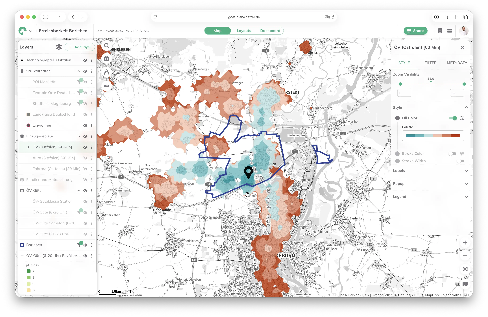

<div id="top"></div>

<p align="center">
<a href="https://plan4better.de/goat">

</a>

<h1 align="center">GOAT</h1>

<p align="center">
Intelligent software for modern web mapping and integrated planning
<br />
<a href="https://plan4better.de/goat">Website</a>
</p>
</p>

<p align="center">
   <a href="https://github.com/plan4better/goat/blob/main/LICENSE"></a>
   <a href="https://github.com/plan4better/goat/pulse"></a>
    <a href="https://github.com/plan4better/goat/issues?q=is:issue+is:open+label:%22%F0%9F%99%8B%F0%9F%8F%BB%E2%80%8D%E2%99%82%EF%B8%8Fhelp+wanted%22"></a>
</p>

<br/>

## ✨ About GOAT

<p align="center">
  <picture>
    <!-- Dark theme -->
    <source srcset="apps/docs/assets/goat_screenshot_dark.webp" media="(prefers-color-scheme: dark)">
    <!-- Light theme -->
    <source srcset="apps/docs/assets/goat_screenshot_light.webp" media="(prefers-color-scheme: light)">
    <!-- Fallback -->
    
  </picture>
</p>


<br/>

GOAT is a free and open source WebGIS platform. It is an all-in-one solution for integrated planning, with powerful GIS tools, integrated data, and comprehensive accessibility analyses for efficient planning and fact-based decision-making.

**Try it out in the cloud at [goat.plan4better.de](https://goat.plan4better.de)**

For more information check out:

[GOAT Docs](https://goat.plan4better.de/docs)

[Follow GOAT on LinkedIn](https://www.linkedin.com/company/plan4better)

[Follow GOAT on Twitter](https://twitter.com/plan4better)

<br/>

## Built on Open Source

GOAT is a **monorepo** project leveraging a modern, full-stack architecture.

### Frontend & Shared UI Components

- 💻 [Typescript](https://www.typescriptlang.org/)

- 🚀 [Next.js](https://nextjs.org/)

- 🗺️ [Maplibre GL JS](https://maplibre.org/)

- ⚛️ [React](https://reactjs.org/)

- 🎨 [MUI](https://mui.com/)

- 🔒 [Auth.js](https://authjs.dev/)

- 🧘‍♂️ [Zod](https://zod.dev/)


### Backend & API Services

- 🐍 [Python](https://www.python.org/)

- ⚡️ [FastAPI](https://fastapi.tiangolo.com/)

- 📦 [Pydantic](https://pydantic.dev/)

- 🗄️ [SQLAlchemy](https://www.sqlalchemy.org/)

- 📊 [PostgreSQL with PostGIS](https://www.postgresql.org/)

- 🔐 [Keycloak](https://www.keycloak.org/)

<br/>


## 🚀 Getting started

### ☁️ Cloud Version
GOAT is also available as a fully hosted cloud service.  If you prefer not to manage your own infrastructure, you can get started instantly with our trial version and choose from one of our available subscription tiers. Get started at [goat.plan4better.de](https://goat.plan4better.de).

### 🐳 Self-hosting (Docker)

**Official support:** We provide a maintained `docker-compose.yml` for running the full GOAT stack in a production‑like environment.

**Important:** While we provide Docker resources, **self‑hosted deployments are community‑supported**. We do not offer official support for managing your infrastructure.

The images for each GOAT service are published on GitHub Container Registry.


#### Requirements

Make sure the following are installed on your server or local machine:

- Docker  
- Docker Compose (plugin syntax: `docker compose`)  
- At least 8 GB RAM recommended

#### Running GOAT with Docker Compose (recommended for most users)

The default `docker-compose.yml` provisions:

- PostgreSQL with PostGIS  
- Keycloak  
- MinIO (S3 compatible storage)  
- GOAT Core (FastAPI backend)  
- GOAT GeoAPI (FastAPI backend for geodata)  
- GOAT Web (Next.js frontend)

#### 1. Clone the repository

```
git clone https://github.com/plan4better/goat.git
cd goat
```

#### 2. Create your configuration file

Copy `.env`:

```
cp .env.example .env
```

Update all required environment variables (see “Environment Variables” section below).

#### 3. Pre‑pull all GOAT images (recommended)

This ensures you always run the latest published versions and avoids building anything locally.

```
docker compose pull
```

#### 4. Start the GOAT stack

```
docker compose up -d
```

Since images were pulled beforehand, **no build steps will run** — everything starts immediately.

#### 5. Access GOAT

- Web UI: [http://localhost:3000](http://localhost:3000)
- Core API: [http://localhost:8000/api](http://localhost:8000/api)
- GeoAPI: [http://localhost:8100](http://localhost:8100)
- MinIO Console: [http://localhost:9001](http://localhost:9001)
- Keycloak Admin: [http://localhost:8080](http://localhost:8080)

#### Updating GOAT

To update an existing installation:

```
docker compose down
docker compose pull
docker compose up -d
```

This will:

1. Stop your stack  
2. Fetch the latest published images  
3. Restart without rebuilding  


#### Build Images Locally

If you are developing the GOAT codebase or making changes to `apps/core`, `apps/geoapi`, or `apps/web`, you may need to build images manually.

Run:

```
docker compose up -d --build
```

Only use this if you’re modifying the GOAT source code.

#### Required Environment Variables

| Variable | Description |
|---------|-------------|
| `POSTGRES_USER` | Username for PostgreSQL authentication |
| `POSTGRES_PASSWORD` | Password for PostgreSQL authentication |
| `POSTGRES_SERVER` | Hostname of the Postgres service (usually `db`) |
| `S3_PROVIDER` | Storage provider (e.g., `minio`) |
| `S3_ACCESS_KEY_ID` | Access key for S3 / MinIO |
| `S3_SECRET_ACCESS_KEY` | Secret key for S3 / MinIO |
| `S3_ENDPOINT_URL` | Internal S3 endpoint (`http://minio:9000`) |
| `S3_BUCKET_NAME` | Name of the S3 bucket to create/use |
| `S3_REGION_NAME` | Region (may remain empty for MinIO) |
| `S3_PUBLIC_ENDPOINT_URL` | Public URL for accessing S3 objects |
| `KEYCLOAK_ADMIN` | Keycloak admin username |
| `KEYCLOAK_ADMIN_PASSWORD` | Keycloak admin password |
| `AUTH` | Backend auth flag (True/False) |
| `NEXT_PUBLIC_APP_URL` | Public URL of the Web UI |
| `NEXT_PUBLIC_API_URL` | Public URL of the Core API |
| `NEXT_PUBLIC_GEOAPI_URL` | Public URL of the GeoAPI (tiles/features) |
| `NEXT_PUBLIC_PROCESSES_URL` | Public URL of the Processes API |
| `NEXT_PUBLIC_ACCOUNTS_API_URL` | Public URL of Accounts API (optional) |
| `NEXT_PUBLIC_DOCS_URL` | URL for documentation |
| `NEXT_PUBLIC_MAP_TOKEN` | MapLibre/Mapbox token |
| `NEXT_PUBLIC_KEYCLOAK_ISSUER` | Keycloak OpenID issuer URL |
| `NEXT_PUBLIC_KEYCLOAK_CLIENT_ID` | Keycloak client ID |
| `KEYCLOAK_CLIENT_SECRET` | Keycloak client secret |
| `NEXT_PUBLIC_SENTRY_DSN` | Sentry DSN (optional) |
| `NEXT_PUBLIC_AUTH_DISABLED` | Enable/disable auth in frontend |
| `NEXT_PUBLIC_ACCOUNTS_DISABLED` | Enable/disable accounts features |
| `NEXTAUTH_URL` | URL for Auth.js backend |
| `NEXTAUTH_SECRET` | Secret key for Auth.js sessions |


## 👩‍⚖️ License

GOAT is a commercial open‑source project. The core platform is licensed under the
[GNU General Public License v3.0 (GPLv3)](https://www.gnu.org/licenses/gpl-3.0.en.html),
which allows anyone to use, modify, and distribute the software under the terms of the GPL.

Some components, such as the Accounts API and features related to user management,
teams, or organizations, are not open source and are provided under a commercial
license. These components are not required for running the core platform but are
available for organizations that need advanced functionality, hosted deployments,
or enterprise‑level capabilities.

This structure makes GOAT accessible for everyone, while providing extended functionalities through
optional commercial services.


|                                   | GPLv3 | Commercial |
| --------------------------------- | ----- | ---------- |
| Self‑host the core platform       | ✅    | ✅         |
| Use for commercial purposes       | ✅    | ✅         |
| Clone privately                   | ✅    | ✅         |
| Fork publicly                     | ✅    | ✅         |
| Modify and redistribute           | ✅    | ❌ (closed parts excluded) |
| Official support                  | ❌    | ✅         |
| Derivative work kept private      | ❌    | ✅ (for commercial components only) |
| Teams / Organizations API         | ❌    | ✅         |
| Authentication integrations       | ❌    | ✅         |
| Hosted SaaS version               | ❌    | ✅         |


## ✍️ Contributing
We welcome contributions of all kinds, bug reports, documentation improvements, new features, and feedback that helps strengthen the platform. Please see our [contributing guide](/CONTRIBUTING.md).
