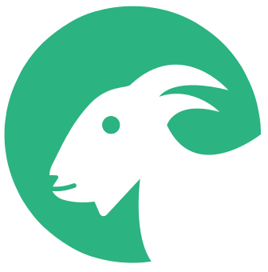

<div id="top"></div>

<p align="center">
<a href="https://plan4better.de/goat" target="_blank" rel="noopener noreferrer">

</a>

<h1 align="center">GOAT</h1>

<p align="center">
Intelligent software for modern web mapping and integrated planning
<br />
<a href="https://plan4better.de/goat" target="_blank" rel="noopener noreferrer">Website</a>
</p>
</p>

<p align="center">
   <a href="https://github.com/plan4better/goat/blob/main/LICENSE" target="_blank" rel="noopener noreferrer"></a>
   <a href="https://github.com/plan4better/goat/pulse" target="_blank" rel="noopener noreferrer"></a>
    <a href="https://github.com/plan4better/goat/issues?q=is:issue+is:open+label:%22%F0%9F%99%8B%F0%9F%8F%BB%E2%80%8D%E2%99%82%EF%B8%8Fhelp+wanted%22" target="_blank" rel="noopener noreferrer"></a>
</p>

<br/>

## ✨ About GOAT

<p align="center">
  <picture>
    <!-- Dark theme -->
    <source srcset=".github/assets/goat_screenshot_dark.webp" media="(prefers-color-scheme: dark)">
    <!-- Light theme -->
    <source srcset=".github/assets/goat_screenshot_light.webp" media="(prefers-color-scheme: light)">
    <!-- Fallback -->
    
  </picture>
</p>


<br/>

GOAT is a free and open source WebGIS platform. It is an all-in-one solution for integrated planning, with powerful GIS tools, integrated data, and comprehensive accessibility analyses for efficient planning and fact-based decision-making.

**Try it out in the cloud at <a href="https://goat.plan4better.de" target="_blank" rel="noopener noreferrer">goat.plan4better.de</a>**

For more information check out:

<a href="https://goat.plan4better.de/docs" target="_blank" rel="noopener noreferrer">GOAT Docs</a>

<a href="https://www.linkedin.com/company/plan4better" target="_blank" rel="noopener noreferrer">Follow GOAT on LinkedIn</a>

<a href="https://twitter.com/plan4better" target="_blank" rel="noopener noreferrer">Follow GOAT on Twitter</a>

<br/>

## Built on Open Source

GOAT is a **monorepo** project leveraging a modern, full-stack architecture.

### Frontend & Shared UI Components

- 💻 <a href="https://www.typescriptlang.org/" target="_blank" rel="noopener noreferrer">Typescript</a>

- 🚀 <a href="https://nextjs.org/" target="_blank" rel="noopener noreferrer">Next.js</a>

- ⚛️ <a href="https://reactjs.org/" target="_blank" rel="noopener noreferrer">React</a>

- 🗺️ <a href="https://maplibre.org/" target="_blank" rel="noopener noreferrer">Maplibre GL JS</a>

- 🎨 <a href="https://mui.com/" target="_blank" rel="noopener noreferrer">MUI</a>

- 🔀 <a href="https://reactflow.dev/" target="_blank" rel="noopener noreferrer">React Flow</a>

- 🔒 <a href="https://authjs.dev/" target="_blank" rel="noopener noreferrer">Auth.js</a>

- 🧘‍♂️ <a href="https://zod.dev/" target="_blank" rel="noopener noreferrer">Zod</a>

### Backend & API Services

- 🐍 <a href="https://www.python.org/" target="_blank" rel="noopener noreferrer">Python</a>

- ⚡️ <a href="https://fastapi.tiangolo.com/" target="_blank" rel="noopener noreferrer">FastAPI</a>

- 📦 <a href="https://pydantic.dev/" target="_blank" rel="noopener noreferrer">Pydantic</a>

- 🗄️ <a href="https://www.sqlalchemy.org/" target="_blank" rel="noopener noreferrer">SQLAlchemy</a>

- 🐘 <a href="https://www.postgresql.org/" target="_blank" rel="noopener noreferrer">PostgreSQL</a>

- 🔐 <a href="https://www.keycloak.org/" target="_blank" rel="noopener noreferrer">Keycloak</a>

### Geospatial & Analytics

- 🦆 <a href="https://duckdb.org/" target="_blank" rel="noopener noreferrer">DuckDB</a>

- 🛶 <a href="https://ducklake.select/" target="_blank" rel="noopener noreferrer">DuckLake</a>

- ⚙️ <a href="https://www.windmill.dev/" target="_blank" rel="noopener noreferrer">Windmill</a>

- 🌍 <a href="https://gdal.org/" target="_blank" rel="noopener noreferrer">GDAL</a>

- 🗃️ <a href="https://docs.protomaps.com/pmtiles/" target="_blank" rel="noopener noreferrer">PMTiles</a>

- 🛰️ <a href="https://stacspec.org/" target="_blank" rel="noopener noreferrer">STAC</a>

<br/>


## 🚀 Getting started

### ☁️ Cloud Version
GOAT is also available as a fully hosted cloud service.  If you prefer not to manage your own infrastructure, you can get started instantly with our trial version and choose from one of our available subscription tiers. Get started at <a href="https://goat.plan4better.de" target="_blank" rel="noopener noreferrer">goat.plan4better.de</a>.

### 🖥️ Self-hosting

GOAT runs on your own infrastructure in two ways:

| | Docker Compose | Kubernetes (Helm) |
|---|---|---|
| **For** | A single Linux server | An existing Kubernetes cluster |
| **Includes** | Everything: web app and APIs, login (Keycloak), object storage, PostgreSQL/PostGIS, the Windmill job engine and HTTPS | GOAT's services, PostgreSQL, Redis and Windmill; you provide S3 storage and, for login, Keycloak |
| **Guide** | [Installation](https://goat.plan4better.de/docs/self_hosting/docker_compose/installation) | [Kubernetes](https://goat.plan4better.de/docs/self_hosting/kubernetes) |

**Docker Compose.** Every GOAT release ships the bundle as
`goat-compose-<version>.tar.gz` on its
[release page](https://github.com/plan4better/goat/releases). With Docker
Engine 24+ and Docker Compose 2.23+ installed:

```bash
tar xzf goat-compose-<version>.tar.gz && cd goat-compose
./setup.sh             # public URL, HTTPS mode, admin email -> .env with generated passwords
docker compose up -d
./smoke.sh             # checks the installation end to end
```

**Kubernetes.** The Helm chart is published as
`oci://ghcr.io/plan4better/charts/goat`:

```bash
helm install goat oci://ghcr.io/plan4better/charts/goat \
  --namespace goat --create-namespace --values your-values.yaml --wait --timeout 25m
```

The [self-hosting guide](https://goat.plan4better.de/docs/self_hosting/overview) compares the two and covers the
configuration, HTTPS, external services, backups and upgrades. The files
behind both live in [`deploy/`](deploy/): the Compose bundle in
[`deploy/compose`](deploy/compose/), the chart in
[`deploy/helm/goat`](deploy/helm/goat/).

**Help with self-hosting:** questions and bug reports are welcome in
[GitHub issues](https://github.com/plan4better/goat/issues), answered as time
allows. Plan4Better also offers **managed on-premise deployment**, running GOAT
on your own servers for you: [get in touch](https://plan4better.de/en/contact/).


## 👩‍⚖️ License

GOAT is a commercial open‑source project. The core platform is licensed under the
<a href="https://www.gnu.org/licenses/gpl-3.0.en.html" target="_blank" rel="noopener noreferrer">GNU General Public License v3.0 (GPLv3)</a>,
which allows anyone to use, modify, and distribute the software under the terms of the GPL.

The full platform — including user management, teams, and organizations — is part
of the open-source core. Optional commercial services (hosting, support, and
enterprise capabilities) are available for organizations that need them.


## ✍️ Contributing
We welcome contributions of all kinds, bug reports, documentation improvements, new features, and feedback that helps strengthen the platform. Please see our [contributing guide](/CONTRIBUTING.md).

### Local development

The `compose.yaml` in the repository root runs the infrastructure for local
development (PostgreSQL, Garage for S3, Redis, Windmill); the apps run on your
machine. Fill in the Garage secrets and key in `.env` first (the comments there
say how to generate them):

```bash
cp .env.example .env
docker compose up -d        # infrastructure; --profile auth adds Keycloak
pnpm install && pnpm web    # web app on http://localhost:3000
uv sync --all-packages      # Python services, then for example:
cd apps/core && uv run uvicorn core.main:app --reload --port 8000
```

It is not a way to run GOAT in production; use the self-hosting options above.
