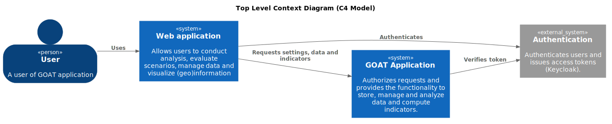
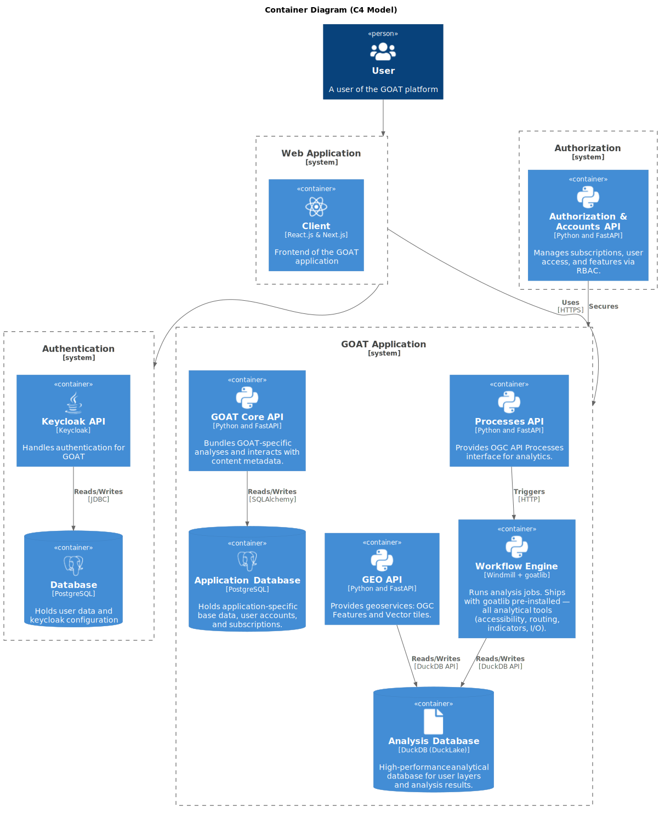

# Software Architecture

The backend of GOAT is making use of a Microservice architecture that is built using a diverse tech stack. The Backend of the GOAT platform is built using the following core technologies:

- [Python](https://www.python.org/)
- [PostgreSQL](https://www.postgresql.org/)
- [PostGIS](https://postgis.net/)
- [FastAPI](https://fastapi.tiangolo.com/)
- [Keycloak](https://www.keycloak.org/)
- [DuckDB / DuckLake](https://duckdb.org/)
- [Windmill](https://www.windmill.dev/)

To describe the software architecture the [C4 Model](https://c4model.com/) is used. The C4 Model is a hierarchical model that describes the software architecture on four different levels. The following sections will describe level 1 and level 2 of the C4 Model, which are context and containers.

## Contexts

#### Web application
The client represents the application's user interface, comprising both a map view and a dashboard view. The dashboard serves multiple functions; it facilitates user account management, project creation, and oversees data management. In contrast, the map view is geared towards project execution, performance of analyses, and visualization and export of results, enabling users to interactively engage with their data.

#### Authentication
The authentication system is responsible for user identity. It authenticates users and provides their roles. (Organization and team data is owned by the GOAT application, not the authentication system.)

#### Authorization
The authorization system takes charge of supervising permissions and subscriptions. Its principal function involves verifying whether a user possesses the requisite permissions to undertake a specific action, thereby maintaining robust control over application access and user activities.

#### GOAT Application
The GOAT application forms the heart of the GOAT platform. Its role includes managing projects, conducting analyses, and generating results. In addition to these duties, the application also performs analyses and accurately delivers the related data, making it a complete solution for data processing and interpretation.

## Containers

The following container diagram is a high-level overview of the different services used in GOAT. The containers are described in more detail in the following sections.

### Web application 

#### React

#### Next.js 

### Authentication
Keycloak is an open-source solution used for authentication and identity management. It identifies users and issues the tokens that carry their roles. Keycloak's own data (user credentials, realm configuration) is stored in a PostgreSQL database. The authoritative organization and team data lives in the GOAT Core API (see Authorization), not in Keycloak.

#### Keycloak API
The Keycloak API is a REST API used to authenticate users and manage user identities. The web application interacts with it directly to authenticate users. 

#### Keycloak Database
The Keycloak Database is a PostgreSQL Database that is used to store the Keycloak data. It is managed by the Keycloak system and we are not directly interacting with it. 

### Authorization

Authorization is a built-in responsibility of the GOAT Core API rather than a separate service. Before any request reaches application logic, core verifies that the user holds the required permissions — and, in SaaS installations, an active subscription — for the requested action, effectively acting as an internal API gateway. The authorization decision is computed in PostgreSQL via the `authorization()` function over the seeded RBAC data (roles, permissions, and resource patterns).

Core also owns the user, organization, team, and subscription data that falls outside Keycloak's scope, stored alongside its other metadata in the GOAT database and accessed through SQLAlchemy. This data also holds references to content uploaded through the GOAT application, tracking how it is shared across teams and organizations, and — for SaaS installations — the subscription state and quota entitlements. To enrich user details, core communicates with the Keycloak API through the `python-keycloak` library, using the user's token to retrieve details and verify roles.

### GOAT Application

The GOAT application is itself composed of several focused FastAPI services, backed by two databases and a workflow engine. A central design principle is the separation of **metadata** (relational, in PostgreSQL) from bulk **geospatial data** (analytical, in DuckLake).

#### GOAT Core API
The Core API, developed in Python and FastAPI, is the central service. It manages projects, folders, scenarios, and layer *metadata*, and — as described under Authorization — owns user, organization, and team management together with the RBAC authorization gateway. It interacts with the Application Database through SQLAlchemy. Crucially, the Core API manages layer *metadata* only; the layer geometries and attributes themselves live in the Analysis Database and are served by the GeoAPI.

#### GeoAPI
The GeoAPI, developed in Python and FastAPI, exposes geospatial data through OGC API Features and Vector Tiles. It handles layer uploads and reads/writes the actual layer data in the Analysis Database (DuckLake). It is deliberately kept separate from the Processes API so that long-running analytics jobs cannot block latency-sensitive tile and feature requests.

#### Processes API
The Processes API, developed in Python and FastAPI, implements the OGC API Processes interface for analytics. It runs lightweight synchronous queries directly and dispatches long-running tools to the Workflow Engine for asynchronous execution, managing the resulting jobs.

#### Workflow Engine (Windmill + goatlib)
Heavy analyses run on [Windmill](https://www.windmill.dev/), which acts as the workflow and job-execution engine. The Windmill workers ship with `goatlib` pre-installed — the shared Python library that contains all of GOAT's analytical features: accessibility and isochrone analyses, routing for car/walking/cycling/public transport, indicator calculations, scenario logic, and data import/export. Every analytical tool is registered as a Windmill job and reads/writes directly from the DuckLake analysis database. This collapses what used to be several dedicated routing services into a single, horizontally scalable execution layer.

#### Application Database
A PostgreSQL database with the PostGIS extension. It holds GOAT's base data (network configuration, opportunity datasets, base settings) along with all metadata managed by the Core API — projects, layers, folders, scenarios, and the user, organization, team, and subscription data. It stores metadata and base data, not user-uploaded layer contents.

#### Analysis Database (DuckLake)
User layers and the outputs of analytical jobs are stored in a [DuckLake](https://ducklake.select/) catalog backed by Parquet on S3 object storage and queried with DuckDB. Keeping high-volume geospatial data here — separate from the relational metadata in PostgreSQL — is the platform's core storage split: metadata in PostgreSQL, data in DuckLake.
