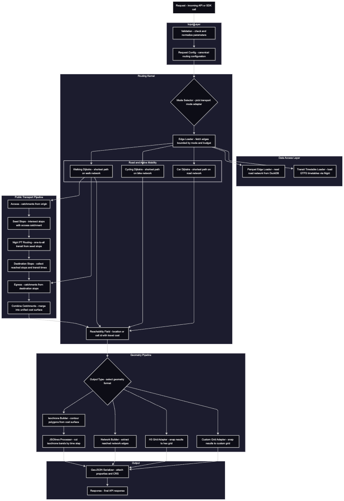

# Routing

Package for flexible and performant multi-modal routing and accessibility analysis. Currently supports one-to-one, one-to-many, many-to-many, and many-to-all routing, along with reverse traversal.

### Modes
- Walking
- Cycling
- Driving
- Public Transport

## Architecture

	

