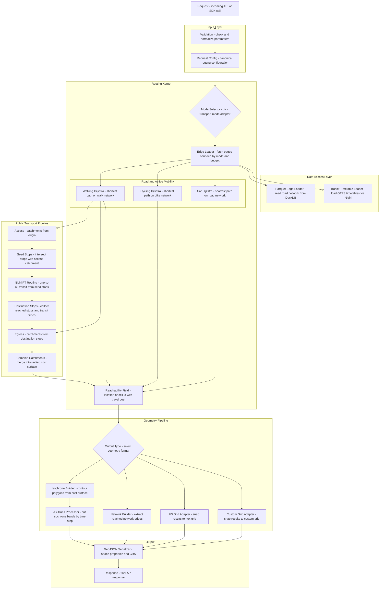

# Catchment + Nigiri Architecture Diagram

## Notes
- Parquet edge loading is mode-aware and happens after mode selection.
- PT flow is explicit: access catchments -> seed stops -> nigiri one-to-all -> destination catchments -> cost surface and reachability.
- Final output adapters are polygon, network, H3 hex grid, and custom snapped grid.
